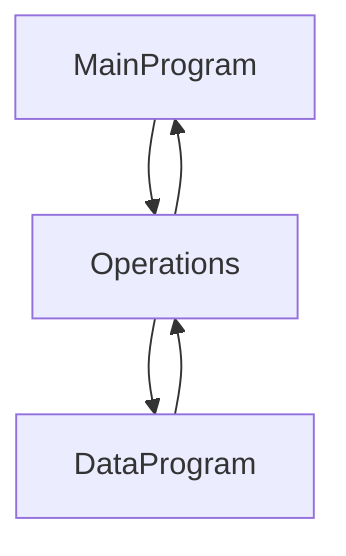
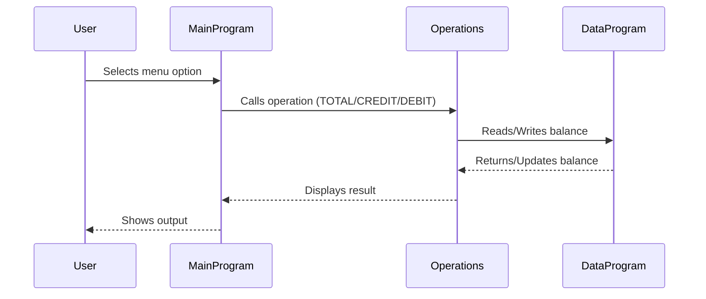

# COBOL Student Account System Documentation

## Overview
This project is a simple COBOL-based student account management system. It consists of three main COBOL files, each serving a distinct purpose:

---

## File Purposes

### main.cob
- **Purpose:** Entry point and user interface for the account management system.
- **Key Functions:**
  - Presents a menu to the user with options: View Balance, Credit Account, Debit Account, Exit.
  - Accepts user input and calls the appropriate operation.
- **Business Rules:**
  - Only allows choices 1-4; invalid choices prompt the user to retry.
  - Calls the Operations module for all account actions.

### operations.cob
- **Purpose:** Handles account operations (view, credit, debit).
- **Key Functions:**
  - Receives operation type from main.cob.
  - For 'TOTAL', reads and displays the current balance.
  - For 'CREDIT', prompts for an amount, adds it to the balance, and updates storage.
  - For 'DEBIT', prompts for an amount, checks for sufficient funds, subtracts if possible, and updates storage.
- **Business Rules:**
  - Debit operation checks for sufficient funds before proceeding.
  - Credit and debit operations update the balance via the DataProgram.

### data.cob
- **Purpose:** Manages persistent storage of the account balance.
- **Key Functions:**
  - Responds to 'READ' requests by returning the current balance.
  - Responds to 'WRITE' requests by updating the stored balance.
- **Business Rules:**
  - Initial balance is set to 1000.00.
  - Only 'READ' and 'WRITE' operations are supported.

---

## Student Account Business Rules
- Accounts start with a balance of 1000.00.
- Credit increases the balance; debit decreases it, but only if sufficient funds exist.
- All operations are routed through the Operations module, which ensures business logic is enforced.
- Invalid menu choices are handled gracefully.

---

## System Flow Diagram

---

## Sequence Diagram: Data Flow

---

For further details, see the source files in `/src/cobol/`.
